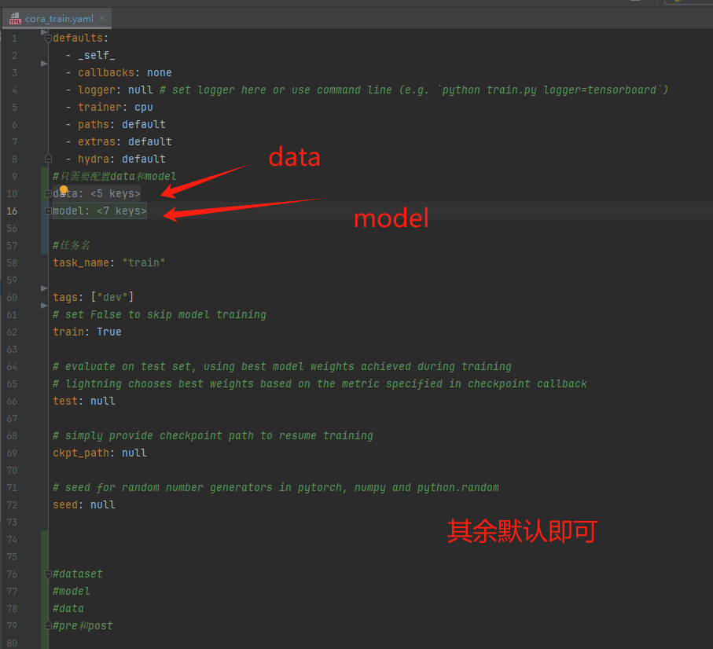
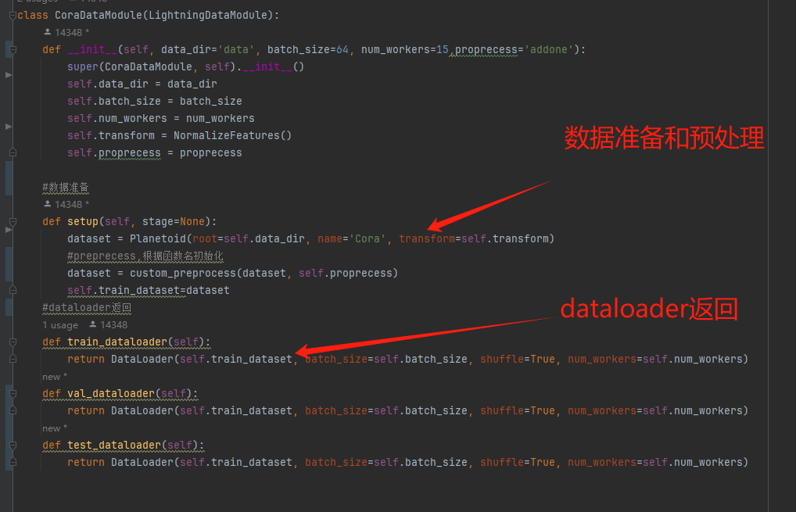
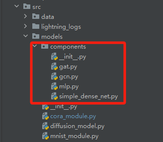
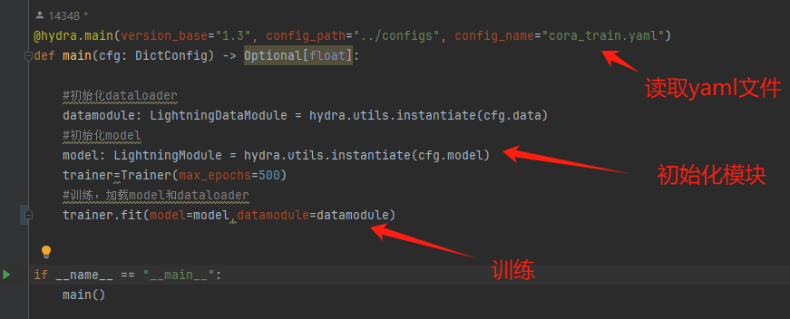

# Lightning-Graph-Diffusion

[](https://github.com/pre-commit/pre-commit)
[](https://pytorch.org/get-started/locally/)
[](https://pytorchlightning.ai/)
[](https://hydra.cc/)

## 1.项目整体框架

```
├── .github                   <- Github Actions workflows
│
├── configs                   <- Hydra configs
│   ├── callbacks                <- Callbacks configs
│   ├── data                     <- Data configs
│   ├── debug                    <- Debugging configs
│   ├── experiment               <- Experiment configs
│   ├── extras                   <- Extra utilities configs
│   ├── hparams_search           <- Hyperparameter search configs
│   ├── hydra                    <- Hydra configs
│   ├── local                    <- Local configs
│   ├── logger                   <- Logger configs
│   ├── model                    <- Model configs
│   ├── paths                    <- Project paths configs
│   ├── trainer                  <- Trainer configs
│   │
│   ├── eval.yaml             <- Main config for evaluation
│   └── train.yaml            <- 训练配置文件
│
├── data                   <- 数据集
│
├── logs                   <- Logs generated by hydra and lightning loggers
│
├── notebooks              <- Jupyter notebooks. Naming convention is a number (for ordering),
│                             the creator's initials, and a short `-` delimited description,
│                             e.g. `1.0-jqp-initial-data-exploration.ipynb`.
│
├── scripts                <- Shell scripts
│
├── src                    <- Source code
│   ├── data                     <- Data scripts
│   ├── models                   <- Model scripts
│   ├── utils                    <- Utility scripts
│   │
│   ├── eval.py                  <- Run evaluation
│   └── train.py                 <- Run training
│
├── tests                  <- Tests of any kind
│
├── .env.example              <- Example of file for storing private environment variables
├── .gitignore                <- List of files ignored by git
├── .pre-commit-config.yaml   <- Configuration of pre-commit hooks for code formatting
├── .project-root             <- File for inferring the position of project root directory
├── environment.yaml          <- File for installing conda environment
├── Makefile                  <- Makefile with commands like `make train` or `make test`
├── pyproject.toml            <- Configuration options for testing and linting
├── requirements.txt          <- File for installing python dependencies
├── setup.py                  <- File for installing project as a package
└── README.md
```

## 2.配置文件

训练的配置文件config\train.yaml，其中只需要配置data和model模块即可，如下图所示：



目前只需要配置data和model即可。

## 3.data模块

data模块配置如下

```
data:
  _target_: src.data.cora_datamodule.CoraDataModule#路径
  data_dir: ${paths.data_dir}#数据集存放路径
  batch_size: 64#参数	
  num_workers: 0#参数
  proprecess: 'addone'#用于预处理，函数名
```

datamodule文件存放在src\data文件夹下，内容如下所示，setup函数用于加载dataset，然后包装成dataloader返回：



也可以直接在该文件下测试：

```
if __name__ == "__main__":

    datamodel = CoraDataModule()
    datamodel.setup()#下载数据
    print(datamodel.train_dataloader)
```

可以看到输出：


## 3.model模块

model模块配置如下：

```
model:
  _target_: src.models.cora_module.CoraLitModule
  #优化器
  optimizer:
    _target_: torch.optim.Adam
    _partial_: true
    lr: 0.01
    weight_decay: 0.0
  #损失函数
  loss:
    _target_: torch.nn.CrossEntropyLoss
  #学习率调整
  scheduler:
    _target_: torch.optim.lr_scheduler.ReduceLROnPlateau
    _partial_: true
    mode: min
    factor: 0.1
    patience: 10
  #网络backbone
  gcn:
    _target_: src.models.components.gcn.GCN#定义好的backbnone类
    input_size: 1433
    hidden_size: 64
    output_size: 7
  gat:
    _target_: src.models.components.gat.GAT#定义好的backbnone类
    input_size: 7
    hidden_size: 28
    output_size: 7
  mlp:
    _target_: src.models.components.mlp.MLP#定义好的backbnone类
    input_size: 7
    hidden_size: 64
    output_size: 7
```

自定义的backbone模型存放在src\models\compoents文件夹下，并按照以上方式在yaml中配置：



module文件位于src\models文件夹下，是定义模型训练的主要模块，各主要方法介绍如下：

初始化函数init，初始化配置文件里的函数和模型，以及一些自定义的参数。


主要训练函数包含两个，train_step和configure_optimizers（这俩是必须要有的，训练过程和更新）。


## 4.训练

训练train.py在src文件夹下，如下：



这里使用Train.fit函数，在model方法里的train_step函数接收到的data就是datamoule模块返回的dataloader中的batch,简化了训练过程。